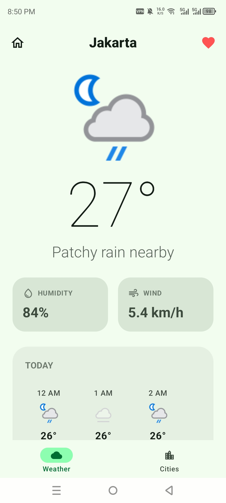
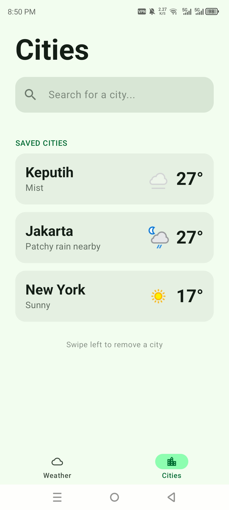
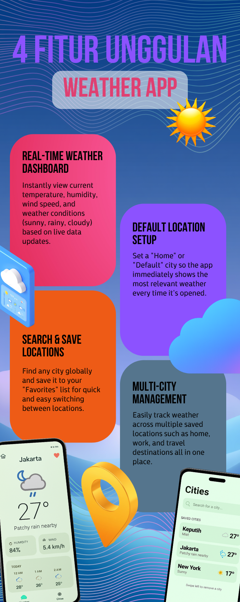

# WeatherApp: Real-Time Weather & Location Tracker

| Nama Anggota | NRP |
|:---:|:---:|
| Muhammad Nabil Afrizal Rahmadani | 5025231014 |
| Randi Palguna Artayasa | 5025231020 |

 

# 🖼️ Screenshots & Infographics

  
  

  

# 📱 APK File
https://drive.google.com/file/d/1Axy_ef5j9GZ6yWnaw_eezJ9whWaFohez/view?usp=sharing

# ▶️ Video Demo
https://drive.google.com/file/d/16h5vlFHlXa1pgiCDmiItzdvKC-RX_o7u/view?usp=sharing

  

# 📖 User Manual
## 1. Informasi Produk
* **Nama Produk:** WeatherApp
* **Versi:** 1.0
* **Platform:** Android
* **Teknologi:**
    * Kotlin
    * Jetpack Compose (UI)
    * Room Database (Local Storage for Cities)
    * MVVM Architecture
    * Navigation Compose
    * StateFlow & LiveData
    * Retrofit / Ktor (Weather API Integration)
    * Material Design 3
* **Target Pengguna:**
    * Daily Commuters
    * Travelers
    * Outdoor Enthusiasts

## 2. Latar Belakang
Pengguna seringkali membutuhkan informasi cuaca yang cepat dan akurat untuk merencanakan aktivitas harian. Aplikasi cuaca standar terkadang terlalu rumit atau tidak memungkinkan pengguna untuk menyimpan lokasi prioritas secara lokal, sehingga pengguna harus berulang kali mengetik nama kota yang sama.

## 3. Tujuan Produk
Membangun aplikasi Android yang memungkinkan:
* Melihat data cuaca real-time secara instan.
* Mengatur lokasi default agar muncul otomatis saat aplikasi dibuka.
* Mencari dan menyimpan daftar kota favorit.
* Mengelola banyak kota dalam satu tampilan (Multi-city management).

## 4. Problem Statement
* Pengguna merasa repot harus mencari kota yang sama setiap kali membuka aplikasi.
* Kebutuhan akan informasi cuaca mendetail (kelembaban, angin) yang seringkali tersembunyi di menu yang dalam.

## 5. Success Metrics
* **Functional Metrics:**
    * Data cuaca berhasil ditarik dari API.
    * Kota favorit tersimpan di Room Database.
    * Lokasi default berhasil dimuat saat startup.
* **Technical Metrics:**
    * Startup time < 2 detik.
    * Data offline (cache) tersedia untuk lokasi yang sudah disimpan.
    * UI Responsif pada berbagai ukuran layar.

## 6. User Persona
* **Nama:** Edward
* **Umur:** 25 Tahun
* **Pekerjaan:** Freelancer & Traveler
* **Kebutuhan:**
    * Melihat cuaca di lokasi saat ini dan lokasi tujuan travel.
    * Menyimpan daftar kota yang sering dikunjungi agar tidak perlu mencari ulang.

## 7. Scope Produk
* **In Scope:**
    * Real-time Weather Dashboard
    * Default Location Setting
    * Search & Save City
    * Multi-city Management list
    * Room Database Integration
* **Out of Scope:**
    * Weather Radar Maps
    * Social Media Sharing
    * Weather News Feed
    * Hourly detailed graphs (v1 focus on current data)

## 8. User Flow
1. User membuka aplikasi (Splash Screen).
2. Sistem memuat lokasi default dari database.
3. Dashboard menampilkan cuaca real-time lokasi tersebut.
4. User menggunakan Navigation Footer untuk pindah ke halaman Search.
5. User mencari kota baru dan menekan ikon "Save".
6. Kota tersimpan di daftar favorit dan dapat diakses kapan saja.

## 9. Functional Requirements
* **FR-01: Real-Time Dashboard**
    * Menampilkan suhu, kelembaban, kecepatan angin, dan deskripsi kondisi.
* **FR-02: Default Location Setup**
    * Pengguna dapat menandai satu kota sebagai "Home" yang akan tampil otomatis.
* **FR-03: Search & Save Locations**
    * Fitur pencarian kota global dengan opsi simpan ke database lokal.
* **FR-04: Multi-City Management**
    * Menampilkan list lokasi yang disimpan dan memungkinkan user menghapus lokasi.

## 10. Non-Functional Requirements
* **Performance:** API call latency handling dengan loading state.
* **Usability:** Navigasi menggunakan bottom bar (footer) untuk kemudahan akses satu tangan.
* **Reliability:** Data lokasi favorit tetap ada meskipun aplikasi ditutup (Persistent storage).

## 11. Database Design (Room)
**Table: SavedLocations**

| Field | Type |
| :--- | :--- |
| id | Integer (PK) |
| cityName | Text |
| country | Text |
| isDefault | Boolean |
| lastTemp | Double |

## 12. Screen List
1. **Splash Screen:** Menampilkan branding aplikasi.
2. **Main Dashboard:** Tampilan utama cuaca (Suhu, Angin, Kelembaban).
3. **Search Screen:** Input pencarian dan hasil pencarian kota.
4. **Saved Locations Screen:** Daftar kota yang telah disimpan oleh user.

## 13. Navigation Structure
* Main Screen (Default View)
    * ├── Search Screen (via Footer)
    * └── Saved Locations (via Footer)

## 14. Architecture (MVVM)
* **View (Compose):** Observes UI State dari ViewModel.
* **ViewModel:** Menangani logika bisnis, koordinasi API, dan Database.
* **Repository:** Sumber data tunggal (Source of Truth) antara Remote (API) dan Local (Room).

## 15. Future Enhancement (Version 2.0)
* Forecast 7 hari ke depan.
* Push Notification untuk peringatan cuaca buruk.
* Widget untuk Home Screen Android.

## 16. Deliverables
* Source Code Kotlin
* Implementation Room Database & Retrofit
* Jetpack Compose UI Layout
* APK File (Debug & Release)
* User Manual (This Document)

## 17. Definition of Done (DoD)
* [x] Dashboard menampilkan data real-time.
* [x] Fitur simpan/hapus lokasi berfungsi.
* [x] Lokasi default termuat saat aplikasi dibuka.
* [x] Navigasi Footer berfungsi antar halaman.
* [x] Aplikasi tidak crash saat tidak ada koneksi internet.
